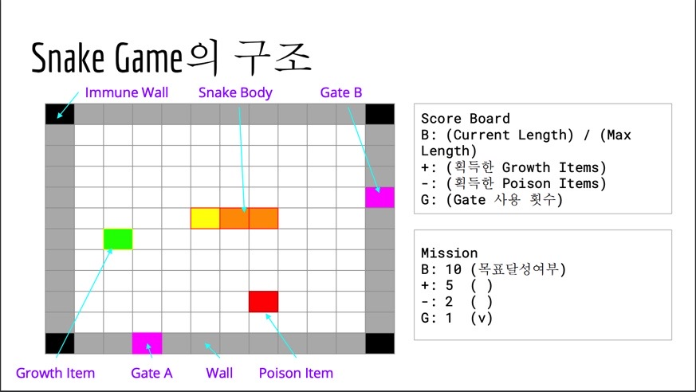

# C++ snake game

C++ 프로그래밍 언어로 ncurses 라이브러리를 사용하여 Snake Game을 구현한다.

---

## Game Structure



---

## User Manual

게임 실행 시 Stage 1부터 시작한다. 입력은 방향키(↑↓←→)를 이용하여 조작할 수 있다. Snake 의 이동은 0.5초마다 이루어진다. 흰색은 Wall, 파란색은 Immune Wall, 빨간색은 Poison Item, 초 록색은 Growth Item, 보라색은 Gate, 노란색과 청록색은 각각 Snake Head와 Snake Body이다. Growth Item을 획득하면 Body의 길이가 1 증가한다. Poison Item을 획득하면 Body의 길이가 1 감 소한다. Gate에 진입하면 다른 Gate로 진출한다. Mission Board에 제시된 목표를 달성하면 다음 Stage로 넘어간다. Mission 목표는 매 게임마다 새롭게 바뀐다. 현재 Score 는 Score Board에서 확 인할 수 있다. Snake가 Wall과 충돌하거나 진행 방향과 반대 방향의 키를 입력하거나 Snake의 길 이가 3보다 작아지면 실패한다. 총 4개의 Stage로 이루어져있어 모든 Stage를 Clear하거나 실패 시 게임이 종료된다.

---

## How to install and use

1. 소스코드와 Make 파일을 같은 경로에 둔다.
2. 터미널에서 make all 을 입력한다.
3. 컴파일한 결과로 SnakeGame 파일이 생성된다.
4. 터미널에서 다음 코드를 입력한다.

```
$ ./SnakeGame
```

---

게임에 대한 룰과 더 자세한 내용은 ppt + report 파일 안에 설명되어 있습니다.
